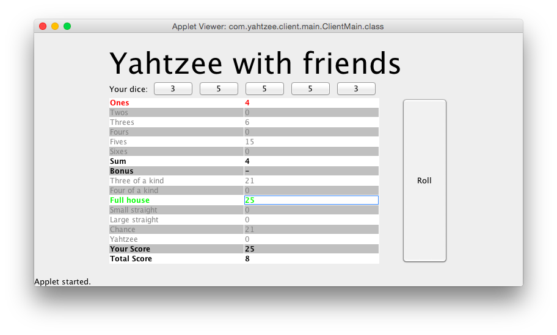

Yahtzee with Friends
====================

This is the Assignment 1 submission for JP's COMP3004 class.

Files included:
- Server.jar - To run the server
- Client.jar - To run the client
- libs/* - Kryonet library used with the client(and server)
- index.html - Page with the Java Applet embedded
- Client/* - Client project folder, containing all the code and classfiles
- Server/* - Server project folder, containing all the code and classfiles
- README.md - This file

How to run
----------
1. Execute Server.jar by typing `java -jar Server.jar` in a terminal window.
2. Execute Client.jar, as an applet, for each client connecting to the server.
3. Enjoy the game

Please note that I've included the Client.jar file, as well as a .html file that embeds it, but I can't seem to get it to work in that format(because of security issues). For that reason, I've included all of the source code as well as the game. It's playable straight from Eclipse.

How to play
-----------
1. In the applet, give yourself a username and hit "New Game".
2. Wait for your friends to join(other clients).
3. In the game, roll your dice by clicking "roll"
4. Mark down your scores by double-clicking on the category you want to score in. Your scores appear in green and your opponents scores appear in red.

Known Issues
------------
1. Finishing the game brings the player back to the lobby, but the game is still going on there.
2. Yahtzee Bonuses don't get counted
3. The Full House is counted incorrectly(it shows full house for 3 of a kind)
4. The UI looks really bad, the controls all pile around the middle of the screen
5. Small Straights and Large Straights are not working
6. The dice don't reset each time there's a new round(not a HUGE issue)
7. The game currently supports an unlimited number of players(well, whatever the upper bound of an integer is)
8. It doesn't implement the trace files that were given in cuLearn
